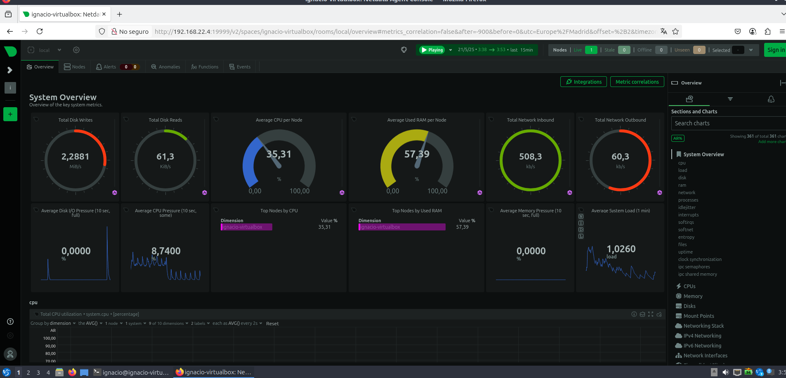

# Despliegue-Red-LDAP-DNS-Interno-App-Web-DB-y-Seguridad-

Topología de la red (IP y nombre de cada equipo):

# PCROUTER

### ¿Que he hecho en el pcrouter?:

- Configurar pcrouter:
  pcrouter va a tener dos redes, una interna y otra nat, esto nos va servir para que las demas maquinas tengas acceso a internet a traves de esta.
  
  

- Configuramos su netplan:
  
  
  
  Una vez terminado de preparar el fichero tendremos que usar el comando:
  
  ``sudo nano netplan apply``
  
  

- Ahora vamos a configurar las iptables:
  Son puros comandos de consola
  
  ``sudo sysctl -w net.ipv4.ip_forward=1 ``
  Pero este comando se borra al reiniciar la maquina, si quieres hacerlo permanente tendremos que ir a:
  
  ``sudo nano sysctl.conf``
  
  y descomentar la linea que es igual que el comando anteriormente dado.
  
  
  
  ``sudo iptables -t nat -A POSTROUTING -o enp0s3 -j MASQUERADE``
  
  ``sudo iptables -A FORWARD -i enp0s8 -o enp0s3 -j ACCEPT``
  
  ``sudo iptables -A FORWARD -I enp0s3 -O enp0s8 -M State -STATE RELATED,ESTABLISHED -j ACCEPT``
  
  Una vez puestos esos comandos vamos a explicarlos un poco:

* **net.ipv4.ip_forward=1** --> Nos permite que el ordenador actúe como un intermediario basicamente.
  
  ``sudo iptables -t nat -A POSTROUTING -o enp0s3 -j MASQUERADE``
  
  ¿que hace esta linea?: Basicamente esta línea hace que todos los ordenadores de nuestra red local que quieran salir a internet se "disfracen" usando la dirección IP del pcrouter para salir por la conexión principal.
  
  

* **-t nat** --> Indica a iptables que vamos a trabajar con la tabla ''nat''
* **-A POSTROUTING** : Añade (-A) una regla a la cadena "POSTROUTING". Esto significa que la regla se aplicará justo después de que el sistema haya decidido por dónde va a salir el paquete de datos.
* **-o enp0s3** : Esta regla solo se aplica al tráfico que sale (-o de output) por la interfaz de red enp0s3.
* **-j MASQUERADE** : Cuando los paquetes de la red local salen a Internet a través de enp0s3, este comando es el que cambia la dirección IP de origen de los paquetes por la dirección IP de enp0s3.
  
  ``sudo iptables -A FORWARD -i enp0se8 -o enp0se3 -j ACCEPT``
  
  ¿Que hace esta linea?: Esta linea basicamente es como abrir una puerta para que lo que llegue desde enp0s8 pueda pasar a la enp0s3.
  
  

* **-A FORWARD**: Es para indicar que esta regla se aplica al tráfico que está siendo reenviado.
* **-j ACCEPT**: Indica que el tráfico que cumpla con estas condiciones debe ser permitido pasar.
  
  ``sudo iptables -A FORWARD -i enp0s3 -o enp0s8 -m state --state RELATED,ESTABLISHED -j ACCEPT``
  
  ¿Que hace esta linea?: Es la que nos permite que las respuestas que nos da internet puedan volver a nuestra red interna.
* **-m state**: Le dice a iptables que use el módulo de seguimiento de conexiones.
* **--state RELATED,ESTABLISHED**: Significa que solo se permitirá el tráfico que esté relacionado con una conexión que ya se inició desde tu red local.

Con eso ya tendriamos las iptables configuradas pero tenemos que instalar una cosita para que cuando reinicemos el pc las normas puestas no se borren y esto seria:

- ``sudo apt-get install iptables-persistent``
  
  Y para aplicarlo:

* ``+sudo netfilter-persistent save``

Si quisieramos reedirigir la informacion que nos llega desde un puerto a otro seria asi:

``sudo iptables -t nat -A OUTPUT -p tcp --dport 80 -j REDIRECT --to-port 8080``

---

# Ahora pasemos a instalar LDAP:

``sudo apt-get install slapd ldap-utils``

``sudo dpkg-reconfigure slapd``

Tras estos dos comandos nos saltara un instalador para Ldap donde deberemos poner lo siguiente:

* Nombre del dominio.
* El nombre de la organizacion.
* Elegimos una contraseña de admin.
* Cuando nos diga que si queremos quitar la DB le decimos que no.
* Y cuando nos diga de mover la antigua le diremos que si.

Y con eso ya tendriamos ldap en nuestra maquina server.

### Vamos con el usuario:

El paso 1 y 2 se pueden omitir si ya los tienes creados.

1. Creamos una unidad organizativa:
   
   ``sudo nano ou_people.ldif``
   
   y lo añadimos:
   
   ``ldapadd -x -D cn=admin,dc=dominya,dc=com -W -f ou_people.ldif``
   
   
   
   

2. Creamos un grupo:
   
   ``sudo nano buengrupo.ldif``
   
   
   
   y lo añadimos:
   
   ``ldapadd -x -D cn=admin,dc=dominya,dc=com -W -f buengrupo.ldif``
   
   

3. Creamos el usuario:
   
   ``miguelUser.ldif``
   
   
   
   y lo añadimos:
   
   ``ldapadd -x -D "cn=admin,dc=dominya,dc=com" -W -f javiUser.ldif``

# Ahora pasemos a preparar el DNS:

1. Instalamos bind9:
   
   ``sudo apt-get install bind9``
2. Vamos a configurar el siguiente fichero donde vamos a decir donde se encuentran los ficheros de zona y zona inversa:
   
   ``sudo nano /etc/bind/named.conf.local``
   
   
   
   

3. Pasemos a configurar el fichero zona y zona inversa:
   
   * Primero copiamos el fichero de zona y de zona inversa de ejemplo que tenemos para poder tener una buena estructura:
     
     ``sudo cp /etc/bind/db.local /etc/bind/db.dominya.com``
     
     ``sudo cp /etc/bind/db.127 /etc/bind/db.192.168.22 ``
     
     

   * Ahora editamos el fichero zona:
     
     ``sudo nano /etc/bind/db.dominya.com``
     
     
   * Ahora editamos el fichero zona inversa:
     
     ``sudo nano /etc/bind/db.192.168.22``
     
     
     
     Podemos comprobar si tenemos bien el fichero a traves de:
     
     ``sudo named-checkzone 22.168.192.in-addr.arpa /etc/bind/db.192.168.22``
     
     Una vez ya lo tengamos todo solo tendremos que reiniciar el servicio de bind9:
     
     ``sudo systemctl restart bind9``

# PCCLIENT:

### ¿Que he hecho en el pcclient?:

1. Configurar el netplan para darle una ip y poder tener salida internet.
   
   

👀️  ``sudo netplan apply`` no te olvides.

2. Instalamos ldap-client:

``sudo apt-get install libnss-ldap libpam-ldap ldap-utils nscd``

Y durante la instalacion:

* URI del servidor LDAP: ldap://192.168.22.1
* DN de búsqueda: dc=dominya,dc=com
* Versión LDAP: 3
* Hacer que la base de datos local sea escribible: No
* ¿Exigir inicio de sesión para realizar acciones administrativas?: No
* ¿Permitir que el administrador LDAP se comporte como administrador local?: Sí
* ¿Permitir acceso sin contraseña?: No
  

3. Ahora tenemos que configurar el fichero ``/etc/nsswitch.conf``:
   ¿Para que nos sirve este archivo? pues es fundamental para decirle al sistema Linux cómo debe buscar y resolver información sobre diferentes tipos de datos
   
   
   
   

4. Ahora vamos a aplicar una pequeña opcion poniendo el siguiente comando:
   
   ``sudo pam-auth-update``
   
   Este comando nos dara distintas opciones pero a nosotros la que nos interesa es para que se cree automaticamnete el directorio del usuario ldap.
   
   
   
   

5. Por ultimo inicamos sesion:
   
   ``su - usuario``

# PCDB:

### ¿Que he hecho en pcdb?:

1. Configurar el netplan:
   
   
   
   👀️  ``sudo netplan apply`` no te olvides.
   
   

2. Instalar mysql:
   
   ``sudo apt install mysql-server -y``
   
   ``sudo mysql_secure_installation``
   
   El secure installation es para ejecutar un asistente interactivo para hacer que la instalación de MySQL sea más segura, configurando contraseñas, eliminando usuarios y bases de datos de prueba, y ajustando permisos por defecto.
   
   

3. Ahora vamos a crear un usuario y una base de datos para dejarla lista para nuestro servicio web:
   
   * 1.- Vamos a acceder como root a mysql con el siguiente comando:
     
     ``sudo mysql -u root -p``
     
     

   * 2.- Una vez dentro crea una base de datos con el nombre que tu quieras(como mi sevicio es moodle yo ya lo voy a crear orientado a ello):
     
     ``CREATE DATABASE moodle_db;``
     
     

   * 3.- Creamos el usuario para esa base de datos y le damos privilegios:
     
     ``CREATE USER 'moodle_nacho'@'192.168.22.3' IDENTIFIED BY '123';``
     
     ``GRANT ALL PRIVILEGES ON moodle_db.* TO 'moodle_nacho'@'192.168.22.3';``
     
     ``FLUSH PRIVILEGES;``
     
     

   * 4.- Ya podemos salir de mysql:
     
     ``exit;``
     
     

4. Ahora es el turno de bloquear a pcclient para que no pueda acceder a la base de datos y que solo pcweb pueda acceder a ella. Para ello escribiremos los siguientes comandos:

* ``sudo ufw allow from 192.168.22.3 to any port 3306``
  

* ``sudo ufw deny from 192.168.22.2 to any port 3306``
  

* ``sudo ufw enable``

# PCWEB:

### ¿Que he hecho en pcweb?:

1. Configurar Netplan:
   
   
   
   👀️  ``sudo netplan apply`` no te olvides.
   
   

2. Vamos a instalar todas las dependecias para tener apache y php:
   
   ``sudo apt install apache2 php libapache2-mod-php php-mysql php-curl php-zip php-xml php-mbstring php-gd php-intl php-soap -y``
   
   Desglosemos esto un poco:
   
   * apache2: Aqui estamos instalando el servidor web Apache que es uno de los servidores web más populares y utilizados en el mundo.
     

   * php: Aqui estamos instalando el intérprete de PHP. ¿Y que es php? pues se trata de un lenguaje de programación muy popular para el desarrollo web. Nos permite crear sitios web dinámicos.
     

   * libapache2-mod-php: Se podria decir que es el "pegamento" que permite que el servidor web Apache pueda ejecutar código PHP. Nos integra PHP directamente en Apache, de modo que cuando Apache recibe una solicitud para un archivo .php, sabe cómo procesarlo con el intérprete de PHP y enviar el resultado al navegador.
     

   * php-mysql: Nos proporciona la conectividad de PHP con bases de datos de MySQL. Es esencial ya que necesitamos que nuestro servicio web se mantenga a traves de un base de datos porque necesitamos almacenar y recuperar datos de una de estas.
     

   * php-curl: Nos instala la extensión cURL para PHP. ¿Y que es cURL? pues cURL nos permite que PHP haga solicitudes HTTP/HTTPS a otros servidores web, lo cual es muy útil para consumir APIs externas, descargar archivos, etc.
     

   * php-zip: Lo que nos permite que PHP cree y manipule archivos ZIP
     

   * php-xml: Nos proporciona soporte para procesar XML en PHP, lo que nos es útil para intercambiar datos estructurados.
     

   * php-mbstring: Nos ofrece funciones para trabajar con cadenas de caracteres multibyte. Osea se que con esto podemos usar nuestra querida ``ñ``.
     

   * php-gd: Es para instalar la librería GD para PHP que nos permite que PHP manipule imágenes de forma dinámica, por si quieres subir alguna imagen a la pagina web, etc.
     

   * php-intl: Nos proporciona funcionalidades para internacionalización osea se para poder usar distintos idiomas, fechas, formatos de hora, etc.
     

   * php-soap: Habilita el soporte para el protocolo SOAP (Simple Object Access Protocol) en PHP que es basicamente para que podamos comunicarnos entre servicios web.
     

3. Como ya dije el sevicio web que he elegido es moodle asique vamos a instalarlo:
   
   * 1.- Vamos a su pagina web: [Link de descarga Moodle](https://download.moodle.org/releases/latest/) y descargamos la version mas reciente.
     
     
     
     

   * 2.- Una vez instalado vamos a moverlo a un directorio ya con un nombre a tu eleccion:
     
     ``sudo mv /var/www/html/moodle /var/www/html/estudyo``
     
     

   * 3.- Cambiamos los permisos de la carpeta al usuario de apache que es **Data**:
     
     ``sudo chown -R www-data:www-data /var/www/html/estudyo``
     (El ``-R`` es para que haya recursividad y que todos estos permisos tambien se apliquen a todas las carpetas que hay dentro)
     
     Y le damos los permisos pertinentes para que Data pueda manipular a placer las carpetas:
     
     ``sudo chmod -R 755 /var/www/html/mi-aula-virtual``
     
     

   * 4.- Ahora vamos a crear una carpeta para guardar los datos de moodle y tenerlos localizados ya que luego en la instalacion nos pedira la ruta. En mi caso yo los coloque aqui:
     
     ``sudo mkdir /var/moodledata``
     
     

     👀️ No te olvides de volver a darle a Data los persmisos para esta carpeta.
     

4. Ahora vamos a prepara en eltorno virtual de Apache:
   
   * 1.- Creamos el fichero de configuracion Apache para crear un virtual host:
     
     ``sudo nano /etc/apache2/sites-available/moodle.conf``
     
     
     
     ¿Para que es esto? Sencillamente para poder acceder a nuestra pagina a traves del nombre del dominio en vez de solo por la ip del servidor.
     
     

   * 2.- Por ultimo aplicamos los siguientes tres comandos para activar nuestro sitio web:
     
     * ``sudo a2ensite moodle.conf``
       

     * ``sudo a2enmod rewrite``
       

     * ``sudo a2enmod rewrite``
       

5. Y ya esta, por ultimo solo tendriamos que acceder a nuestra pagina web y ya tendriamos moodle listo para funcionar, tendremos una instalacion guiada muy sencilla de moodle.

# Apps Extras:

### Copia de seguridad con mysql dumb:

1. Primero vamos a crear directorio para guardar el backup y le vamos a dar permisos 777:
   
   ``sudo mkdir -p /backups/mysql``
   
   ``sudo chown 777 /backups/mysql``
   
   

2. Ahora vamos a crear el script para que se ejecute cada minuto con crontab:
   
   * El Script: ``sudo nano backup_moodle.sh``
     
     
     
     ¿Que estoy haciendo en el script?:
     
     * 1.- Declarar variables.
     * 2.- Quitar la copia de seguridad anterior antes de almacenar la nueva.
     * 3.- Usar mysql dumb para almacenar la copia de seguridad en la carpeta que hemos creado anteriormente.
     * 4.- Comprimir la copia de seguridad para que no ocupe tanto.
       

   * Y ahora con crontab vamos a programar su uso cada minuto:
     
     * 1.- Pon el modo superusuario anter de abrir crontab, ya sabes ``sudo su`` ¿porque? Pues basicamente para que se cree con permisos de administrador y no haya problema al intentar ejecutar el scrip.
     * 2.- Inicia crontab con ``crontab -e`` y te dira que modo de contab entre 4 quieres usar, pon el 1 ya que hasta el mismo te dice que es el mas facil.
     * 3.- Programa crontab de la siguiente manera para que te ejecute el script cada minuto:
       
       ``*/1 * * * * /home/ignacio/backup_moodle.sh``
       
       
       
       

3. Y ya esta, ya tendriamos la copia de seguridad lista para usarse en caso de accidente y ademas se va generando una nueva cada minuto.
   
   

4. Para usarla tendriamos que descomprimir el archivo zip y meternos en mysql, una vez dentro solo tendriamos que decir que base de datos vamos a usar y poner el siguiente comando:
   
   ``SOURCE /ruta/al/tu_copia_de_seguridad.sql;``

---

### Netdata:

(👀️ Este extra se encuentra en mis 4 maquinas y en todas esta configurado de la misma manera)

1. Empezamos instalando netdata:
   
   ``sudo apt-get install netdata -y``
2. Lo iniciamos y ponemos para que se inicie cada vez que se reinica el sistema y comprobamos que se esta ejecutando correctamente:
   
   * ``sudo systemctl start netdata``
     

   * ``sudo systemctl enable netdata``
     

   * ``sudo systemctl status netdata``
     

3. Vamos a configurarlo tocando un solo detalle de su archivo conf:
   
   ``nano /etc/netdata/netdata.conf``
   
   Y buscamos la linea: **bind socket to IP = 127.0.0.1.**
   Y tienes que cambiarla por la ip actual que tienes en el servidor.
   
   
   
   

4. Si teneis el cortafuego activado como es mi caso en la base de datos debereis darle paso al puerto 19999 que es el de net data:
   
   ``sudo ufw allow 19999``
   
   ``sudo ufw reload``
5. Por ultimo ya es dirigirte al navegador web que quieras y monitorizar tu pc:
   
   ``http://your-server-IP-address:19999``
   
   

---

### Webmin:

1. Vamos a instalar todas las dependencias necesarias:
   
   ``sudo apt install -y perl libnet-ssleay-perl openssl libauthen-pam-perl libpam-runtime libio-pty-perl``
   
   Desglosemos un poco esto:
   
   * ``pearl``: Es el lenguaje de programacion usado por webmin.
     

   * ``libnet-ssleay-perl``: Esto proporciona a pearl soporte SSL/TLS osea se pura seguridad para comunicaciones de red. Es vital para que Webmin pueda comunicarse de forma segura con otros servicios, y también para que sus módulos de red puedan funcionar.
     

   * ``openssl``: Con esto estamos instalando las herramientas de línea de comandos y librerías para OpenSSL. ¿Y que es OpenSSL? pues es una biblioteca criptográfica esencial que proporciona funciones para SSL/TLS, cifrado, firmas digitales, etc. Muchos servicios y aplicaciones en Linux dependen de ella para la seguridad de las comunicaciones.
     

   * ``libauthen-pam-perl``: Nos permite que a los programas de Perl (como Webmin) puedan interactuar con PAM (Pluggable Authentication Modules).¿Y que es PAM? es el sistema que maneja la autenticación de usuarios en Linux. Es lo que va a dejar que webmin pueda autenticar usuarios, cambiar contraseñas, etc.
     

   * ``libpam-runtime``: Este paquete deja listo para usar la dependecia anterior.
     

   * ``libio-pty-perl``: Otro módulo de Perl. Esta vez esta dependencia nos proporciona una interfaz para pseudo-terminales (PTYs). Es útil para programas que necesitan interactuar con terminales como si fueran usuarios (por ejemplo, para ejecutar comandos con salida interactiva, algo que Webmin puede necesitar para algunas operaciones).
     

2. Vamos a la [pagina oficial de webmin](https://webmin.com/download/) y seguimos los pocos pasos que hay para instalar webmin.
   
   

3. Si tenemos firewall activado tendremos que darle paso al puerto de webmin que es el 10000:
   
   ``sudo ufw allow 10000/tcp``
   
   ``sudo ufw enable``
   
   

4. Accedemos a la web de webmin a traves de ``https://tu-ip:10000`` y podremos ver la interfaz de webmin, solo tendremos que iniciar sesion a traves de nuestro usuario linux y la contraseña que tengamos en ese mismo usuario.
   
   
   
   Webmin nos va a permitir (entre otras muchas cosas) gestionar visualmente nuestro servidor ldap y dns.

